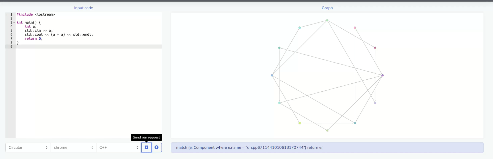

# Awesome C++ Parsers
An overview of C and C++ parsers available for Kotlin/JVM and Kotlin/MP

## [Clang](https://clang.llvm.org)

### CLI (`clang`)

 * Kotlin/JVM ✔, Kotlin/MP ✔
 * Available since at least _Clang_ version 11.
 * [_Rust_ bindings](https://github.com/dtolnay/clang-ast)

#### Overview

Getting an AST tree is as easy as

```bash
clang++ -fsyntax-only -Xclang -ast-dump=json file.cc >file.json
```

The AST can also be dumped in binary form, to be later on consumed and parsed by
[`libclang`](#libclang-c-interface-to-clang) ([example](https://bastian.rieck.me/blog/posts/2015/baby_steps_libclang_ast/)):

```bash
# Will produce file.ast
clang++ -emit-ast file.cc
```

#### Example

Here's a [JSON output](Shape.json) for a [sample C++ class](Shape.cc).

Field access on [line 8](Shape.cc#L8) is correctly recognized as a
[`clang::MemberExpr`](Shape.json#L554)
([reference](https://clang.llvm.org/doxygen/classclang_1_1MemberExpr.html)).

Notably, GCC-style mangled C++ symbol names are also stored in the JSON:

```json
{
   "id": "0x8001988b0",
   "kind": "ParmVarDecl",
   "loc": {
      "offset": 36,
      "line": 3,
      "col": 15,
      "tokLen": 11
   },
   "range": {
      "begin": {
         "offset": 32,
         "col": 11,
         "tokLen": 3
      },
      "end": {
         "offset": 36,
         "col": 15,
         "tokLen": 11
      }
   },
   "isUsed": true,
   "name": "shapeHeight",
   "mangledName": "_ZZN5ShapeC1EiE11shapeHeight",
   "type": {
      "qualType": "int"
   }
}
```

Here, `_ZZN5ShapeC1EiE11shapeHeight` is a mangled name which corresponds to
`Shape::Shape(int)::shapeHeight`:

```console
$ echo '_ZZN5ShapeC1EiE11shapeHeight' | c++filt
Shape::Shape(int)::shapeHeight
```

`ParmVarDecl` specifies a JSON-serialized instance of
[`clang::ParmVarDecl`](https://clang.llvm.org/doxygen/classclang_1_1ParmVarDecl.html)
class from the [C++ API](https://clang.llvm.org/doxygen/namespaceclang.html).

### [`clangd`](https://clangd.llvm.org/)

 * Kotlin/JVM ✔, Kotlin/MP ✔
 * Supports [LSP **3.17**](https://microsoft.github.io/language-server-protocol/specifications/lsp/3.17/specification/)
    plus [extensions](https://clangd.llvm.org/extensions)
 * Can provide [`clang::clangd::ParsedAST`](https://clang.llvm.org/extra/doxygen/classclang_1_1clangd_1_1ParsedAST.html),
    which, in turn, can be used to access [`clang::ASTContext`](https://clang.llvm.org/doxygen/classclang_1_1ASTContext.html)
 * [Features](https://clangd.llvm.org/features)

#### Overview

 * Sample response [JSON response](clangd-response.json) from `clangd`.
 * `clangd` tool window in _CLion_:

     

#### Used by

 * [_JetBrains CLion_](https://www.jetbrains.com/clion/)

### `libclang`: C Interface to _Clang_

 * Java bindings to _Clang_ version **15** are available via
   [_JavaCPP Presets_](https://github.com/bytedeco/javacpp-presets/tree/master/llvm) (Kotlin/JVM ✔, Kotlin/MP ❌).
 * [API reference](https://clang.llvm.org/doxygen/group__CINDEX.html)

#### Overview

 * `libclang` has its limitations
    and [doesn't expose](https://clang.llvm.org/docs/Tooling.html#libclang) the
    entire AST.
    Read [this](https://www.foonathan.net/2017/04/cppast/) for further details.
 * `libclang` tokens are not preprocessed.

#### Examples

 * [Baby steps with libclang: Walking an abstract syntax tree](https://bastian.rieck.me/blog/posts/2015/baby_steps_libclang_ast/)
 * [Using libclang to Parse C++ (aka libclang 101)](https://shaharmike.com/cpp/libclang/)
 * <https://github.com/bytedeco/javacpp-presets/tree/master/llvm/samples/clang>

#### Used by

 * [Fraunhofer-AISEC/cpg](https://github.com/Fraunhofer-AISEC/cpg)

### `LibTooling`: C++ Interface to _Clang_

 * No Kotlin/JVM ❌, no Kotlin/MP ❌ (unless wrappers are written manually)
 * C++ API

#### Links

 * [LibTooling](https://clang.llvm.org/docs/LibTooling.html)
 * [Tutorial for building tools using LibTooling and LibASTMatchers](https://clang.llvm.org/docs/LibASTMatchersTutorial.html)
 * <https://opensource.apple.com/source/clang/clang-425.0.24/src/tools/clang/docs/LibTooling.html>

## [tree-sitter](https://github.com/tree-sitter/tree-sitter)

### Overview

 * Kotlin/JVM ✔ available via [Java](https://github.com/serenadeai/java-tree-sitter)
   or [Kotlin](https://github.com/oxisto/kotlintree) bindings
 * Kotlin/MP ✔ possible by wrapping a native platform binary
 * Kotlin/JS ✔ possible by wrapping `tree-sitter.js`
 * Has built-in support for its own [query language](https://neovim.io/doc/user/treesitter.html#treesitter-query)

Initially it was designed by GitHub for their [Atom IDE](https://github.com/atom/) which was sunset to be replaced by CodeHub/VS Code.
Designed to tokenize code with focus on tracking changes in a file.

 * Articles:

   - [Tree-sitter: обзор инкрементального парсера (in Russian)](https://habr.com/ru/post/670140/)
   - [A Comprehensive Introduction to Tree-sitter](https://derek.stride.host/posts/comprehensive-introduction-to-tree-sitter)
   - ["Tree-sitter - a new parsing system for programming tools" by Max Brunsfeld](https://www.youtube.com/watch?v=Jes3bD6P0To)
   - [How to write a linter using tree-sitter in an hour](https://siraben.dev/2022/03/22/tree-sitter-linter.html)
     - [Discussion on Hacker News](https://news.ycombinator.com/item?id=30822544)

 * Activity of the project:
 Project contains two parts: parser (specification) and binding (api).
 Specification are hosted under the main GitHub organization [tree-sitter](https://github.com/tree-sitter) and looks like it's being updated (checked java/cpp).

 But bindings look like a very alpha (checked _Java_ and _Kotlin_).

 According to the [`README.md`](https://github.com/tree-sitter/tree-sitter#readme)
 and articles: looks like `tree-sitter` is targeted at Web:
 `Web Tree-sitter`/`WASM` is part of the main library:
 <https://github.com/tree-sitter/tree-sitter/tree/master/lib/binding_web>.

 Additionally, it's used as a plugin in popular editors and actively supported:
 [_Neovim_](https://github.com/nvim-treesitter) and
 [_Emacs_](https://github.com/emacs-tree-sitter)

#### Limitations

The parser of _tree-sitter_ doesn't always track context,
so, using the following C++ source code,

```c++
class Shape {
public:
   Shape(int shapeHeight) {
       height = shapeHeight;
   }

   int getHeight() {
       return height;
   }

private:
   int height;
};
```

&mdash;
it incorrectly recognizes field access as an
`identifier` (i.e. local variable) and not a `field_identifier`
(for the code to be parsed correctly,
one should change `height` &rarr; `this.height`).
The same problem affects even simpler-to-parse languages,
such as _Java_ and _Kotlin_.

For example,
both field access and local variable access are erroneously recognized as `simple_identifier`:

```kotlin
class Shape(private val height: Int) {
    fun getHeight(): Int {
        return height
    }
}
```

Another example is inability to differentiate between a function call and a
macro call in C and C++:

```c
static void f1() {
    // ...
}

static void f2() {
    // ...
}

#define f1() f2()

void g() {
    // Calls `f2()`, not `f1()`.
    f1();
}
```

### PoC
Tried to create a POC using **tree-sitter**. Run on WSL\Linux.

 * [Java bindings](https://github.com/serenadeai/java-tree-sitter):
   Here is a branch: https://github.com/saveourtool/save-cloud/compare/master...feature/java-tree-sitter
   
   It fails with error in C code:
   ```console
   15:02:06.519 [main] INFO c.s.save.demo.cpg.SaveDemoCpgKt - Started SaveDemoCpgKt in 49.612 seconds (JVM running for 63.49) 
   15:03:04.447 [boundedElastic-1] INFO c.s.s.d.cpg.controller.CpgController - Created a file with sources: demo.java
   #
   # A fatal error has been detected by the Java Runtime Environment:
   #
   #  SIGSEGV (0xb) at pc=0x00007f547c49bd3d, pid=2570, tid=2727
   #
   # JRE version: OpenJDK Runtime Environment (17.0.3+7) (build 17.0.3+7-Ubuntu-0ubuntu0.22.04.1)
   # Java VM: OpenJDK 64-Bit Server VM (17.0.3+7-Ubuntu-0ubuntu0.22.04.1, mixed mode, emulated-client, sharing, tiered, compressed oops, compressed class ptrs, g1 gc, linux-amd64)
   # Problematic frame:
   # C  [libjava-tree-sitter.so+0x2bd3d]  ts_tree_root_node+0xd
   #
   # No core dump will be written. Core dumps have been disabled. To enable core dumping, try "ulimit -c unlimited" before starting Java again
   #
   # An error report file with more information is saved as:
   # /mnt/d/projects/save-cloud/hs_err_pid2570.log
   #
   # If you would like to submit a bug report, please visit:
   #   Unknown
   # The crash happened outside the Java Virtual Machine in native code.
   # See problematic frame for where to report the bug.
   #
   Aborted
   ```
 * [Kotlin bindings](https://github.com/oxisto/kotlintree):
   Here is a branch: https://github.com/saveourtool/save-cloud/compare/master...feature/kotlintree

   It does work on Ubuntu: 
 * [Custom grammar](tree-sitter-boolean/README.md)

### Implementations

 * [C++ Grammar](https://github.com/tree-sitter/tree-sitter-cpp) (45 🍴, 156 ⭐)
   * Portable: can be built with at least `g++` **10** and `clang++` **13**
     (and, probably, earlier versions). 
 * [Kotlin bindings](https://github.com/oxisto/kotlintree) (2 🍴, 28 ⭐)
   * Uses JNA. 
   * The native library has to be manually built first (requires `clang++`).
   * The project wraps `libtree-sitter.{so,dylib}` (**0.20.1**) and
     `libtree-sitter-cpp.{so,dylib}` (**0.19.0**) via JNA.
   * _Linux_ and _Mac OS X_ only.
 * [Java bindings](https://github.com/serenadeai/java-tree-sitter) (19 🍴, 61 ⭐)
   * Uses JNI.
   * The native library has to be manually built first.
   * Be sure to clone with `--recurse-submodules`.
   * Can't be built using JDK 17 due to outdated _Gradle_.
 * [Playground](https://tree-sitter.github.io/tree-sitter/playground) (C, C++ and other languages)
 * [Playground](https://fwcd.dev/tree-sitter-kotlin/) (Kotlin grammar, unofficial)


## [CodeQL](https://codeql.github.com)

 * [CodeQL CLI](https://github.com/github/codeql-cli-binaries) is closed-source ❌
 * [CodeQL libraries and queries](https://github.com/github/codeql) are open-source, MIT-licensed ✔
 * For compiled languages like C++, it's necessary to build the project first in
   order to create a CodeQL database.
 * [C and C++ status](https://codeql.github.com/docs/codeql-overview/supported-languages-and-frameworks):
   * C++20 support is currently in beta. Supported for GCC on Linux only. Modules are _not_ supported.
   * Clang (and `clang-cl`) extensions (up to Clang 12.0)
     * Support for the `clang-cl` compiler is preliminary.
   * GNU extensions (up to GCC 11.1)
   * Microsoft extensions (up to VS 2019)
   * Arm Compiler 5
     * Support for the Arm Compiler (`armcc`) is preliminary.
 * _Visual Studio Code_ [integration](https://codeql.github.com/docs/codeql-for-visual-studio-code/)

### Links

 * [Analyzing your projects](https://codeql.github.com/docs/codeql-for-visual-studio-code/analyzing-your-projects/)
 * [Exploring the structure of your source code](https://codeql.github.com/docs/codeql-for-visual-studio-code/exploring-the-structure-of-your-source-code/)
 * [Exploring data flow with path queries](https://codeql.github.com/docs/codeql-for-visual-studio-code/exploring-data-flow-with-path-queries/)
 * [CodeQL for C and C++](https://codeql.github.com/docs/codeql-language-guides/codeql-for-cpp/)
 * [Writing CodeQL queries](https://codeql.github.com/docs/writing-codeql-queries/)
 * [CodeQL CLI manual](https://codeql.github.com/docs/codeql-cli/manual/)

## Eclipse CDT

 * Kotlin/JVM ✔ only, no Kotlin/MP ❌

### Used by

 * [Fraunhofer-AISEC/cpg](https://github.com/Fraunhofer-AISEC/cpg)
 * [joernio/joern](https://github.com/joernio/joern) 

## [`foonathan/cppast`](https://github.com/foonathan/cppast)

 * 157 🍴, 1.5k ⭐
 * No Kotlin/JVM ❌, no Kotlin/MP ❌ (unless wrappers are written manually)
 * C++ API
 * Was built in response to `libclang` limitations
