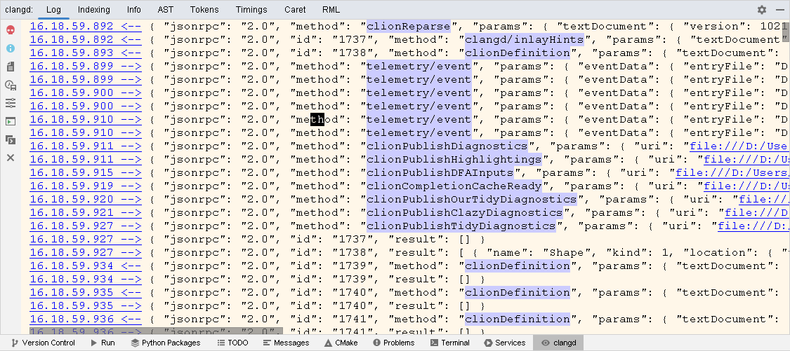

# Awesome C++ Parsers
An overview of C and C++ parsers available for Kotlin/JVM and Kotlin/MP

## [Clang](https://clang.llvm.org)

### CLI (`clang`)

 * Kotlin/JVM ✔, Kotlin/MP ✔
 * Available since at least _Clang_ version 11.
 * [_Rust_ bindings](https://github.com/dtolnay/clang-ast)

#### Overview

Getting an AST tree is as easy as

```bash
clang -fsyntax-only -Xclang -ast-dump=json file.cc >file.json
```

#### Example

Here's a [JSON output](Shape.json) for a [sample C++ class](Shape.cc).

Field access on [line 8](Shape.cc#L8) is correctly recognized as a
[`clang::MemberExpr`](Shape.json#L554)
([reference](https://clang.llvm.org/doxygen/classclang_1_1MemberExpr.html)).

Notably, GCC-style mangled C++ symbol names are also stored in the JSON:

```json
{
   "id": "0x8001988b0",
   "kind": "ParmVarDecl",
   "loc": {
      "offset": 36,
      "line": 3,
      "col": 15,
      "tokLen": 11
   },
   "range": {
      "begin": {
         "offset": 32,
         "col": 11,
         "tokLen": 3
      },
      "end": {
         "offset": 36,
         "col": 15,
         "tokLen": 11
      }
   },
   "isUsed": true,
   "name": "shapeHeight",
   "mangledName": "_ZZN5ShapeC1EiE11shapeHeight",
   "type": {
      "qualType": "int"
   }
}
```

Here, `_ZZN5ShapeC1EiE11shapeHeight` is a mangled name which corresponds to
`Shape::Shape(int)::shapeHeight`:

```console
$ echo '_ZZN5ShapeC1EiE11shapeHeight' | c++filt
Shape::Shape(int)::shapeHeight
```

`ParmVarDecl` specifies a JSON-serialized instance of
[`clang::ParmVarDecl`](https://clang.llvm.org/doxygen/classclang_1_1ParmVarDecl.html)
class from the [C++ API](https://clang.llvm.org/doxygen/namespaceclang.html).

### `clangd`

 * Kotlin/JVM ✔, Kotlin/MP ✔
 * Supports [LSP **3.17**](https://microsoft.github.io/language-server-protocol/specifications/lsp/3.17/specification/)
    plus [extensions](https://clangd.llvm.org/extensions)

#### Overview

 * Sample response [JSON response](clangd-response.json) from `clangd`.
 * `clangd` tool window in _CLion_:

     

#### Used by

 * [_JetBrains CLion_](https://www.jetbrains.com/clion/)

### `libclang`: C Interface to _Clang_

 * Java bindings to _Clang_ version **15** are available via
   [_JavaCPP Presets_](https://github.com/bytedeco/javacpp-presets/tree/master/llvm) (Kotlin/JVM ✔, Kotlin/MP ❌).
 * [API reference](https://clang.llvm.org/doxygen/group__CINDEX.html)

#### Used by

 * [Fraunhofer-AISEC/cpg](https://github.com/Fraunhofer-AISEC/cpg)

## [tree-sitter](https://github.com/tree-sitter/tree-sitter)

### Overview
Initially it was designed by GitHub for theid [Atom IDE](https://github.com/atom/) which was sunseted to be replaced by CodeHub\VS Code.
Desinged to tokenize a code with some of main feature to track changes in file.

 * Articates:
   - https://habr.com/ru/post/670140/ (russina)
   - https://derek.stride.host/posts/comprehensive-introduction-to-tree-sitter

### Implementations
 * [C++ Grammar](https://github.com/tree-sitter/tree-sitter-cpp) (45 🍴, 156 ⭐)
 * [Playground](https://tree-sitter.github.io/tree-sitter/playground) (C, C++ and other languages)
 
   Using the following C++ source code,
   ```cxx
   class Shape {
   public:
       Shape(int shapeHeight) {
           height = shapeHeight;
       }

       int getHeight() {
           return height;
       }

   private:
       int height;
   };
   ```
   &mdash; incorrectly recognizes field access as an `identifier` (i.e. local variable) and not a `field_identifier` (for the code to be parsed correctly, one should change `height` &rarr; `this.height`). The same error affects simpler to parse languages, such as _Java_.
 * [Playground](https://fwcd.dev/tree-sitter-kotlin/) (Kotlin grammar, unofficial)

   Similarly, both field access and local variable access are erroneously recognized as `simple_identifier`:
   ```kotlin
   class Shape(private val height: Int) {
     fun getHeight(): Int {
       return height
     }
   }
   ```
## [CodeQL](https://codeql.github.com)
 * [No public repositories](https://github.com/codeql) ❌
 * [C and C++ status](https://codeql.github.com/docs/codeql-overview/supported-languages-and-frameworks):
   * C++20 support is currently in beta. Supported for GCC on Linux only. Modules are _not_ supported.
   * Clang (and `clang-cl`) extensions (up to Clang 12.0)
     * Support for the `clang-cl` compiler is preliminary.
   * GNU extensions (up to GCC 11.1)
   * Microsoft extensions (up to VS 2019)
   * Arm Compiler 5
     * Support for the Arm Compiler (`armcc`) is preliminary.
 * _Visual Studio Code_ [integration](https://codeql.github.com/docs/codeql-for-visual-studio-code/)

## Eclipse CDT

 * Kotlin/JVM ✔ only, no Kotlin/MP ❌

### Used by

* [Fraunhofer-AISEC/cpg](https://github.com/Fraunhofer-AISEC/cpg)
