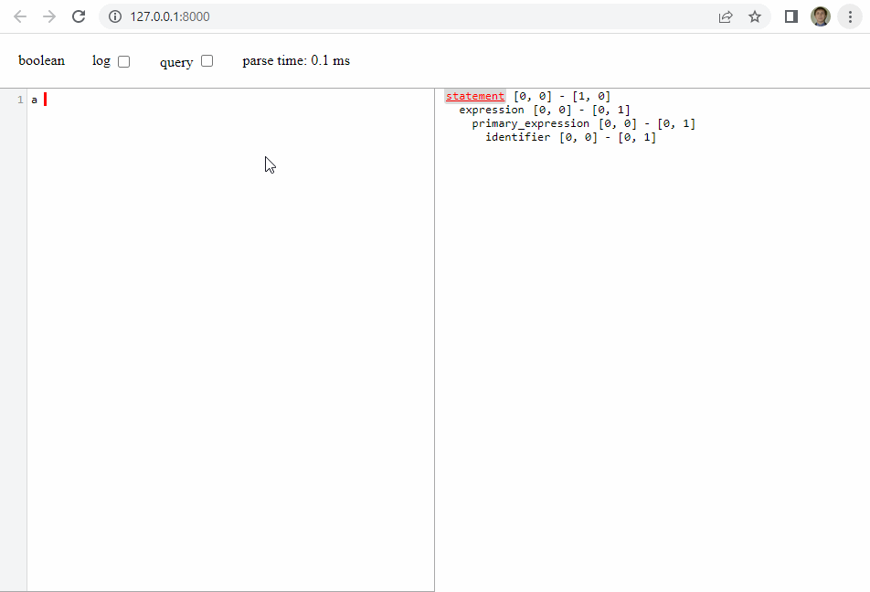

# Custom grammar

[This file](grammar.js) contains a simple grammar for boolean expression.

## Build
1. Just a download latest `tree-sitter` from _GitHub_:
   - Linux: [v0.20.7](https://github.com/tree-sitter/tree-sitter/releases/download/v0.20.7/tree-sitter-linux-x64.gz)
   - Windows: [v0.20.7](https://github.com/tree-sitter/tree-sitter/releases/download/v0.20.7/tree-sitter-windows-x64.gz)
2. Generate the parser:
   ```bash
   cd tree-sitter-boolean
   ./tree-sitter generate
   ```
3. Build __WASM__:
   ```bash
   ./tree-sitter build-wasm
   ```
4. Start a playground:
   ```bash
   ./tree-sitter playground
   ```
5. You can play with this grammar in a browser: (http://127.0.0.1:8000)

## Demonstration
